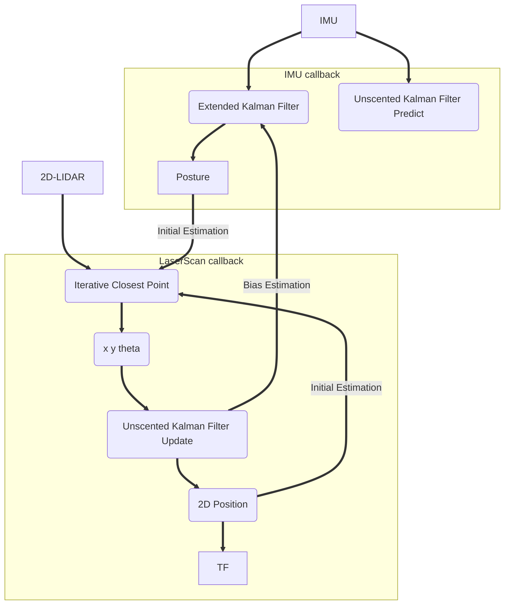

# motiodom
A ROS2 package for 2D Lidar and IMU localization.

# What's motiodom ?

```mermaid
graph 

IMU ==> EKF
IMU ==> UKFP
2D-LIDAR ==> ICP

subgraph IMU callback

EKF(Extended Kalman Filter) ==> Posture

UKFP(Unscented Kalman Filter Predict)

end

subgraph LaserScan callback

ICP(Iterative Closest Point) ==> ICPPOSITION(x y theta)

ICPPOSITION ==> UKFU(Unscented Kalman Filter Update)

UKFU ==> POSITION(2D Position)

POSITION ==> |Initial Estimation|ICP

POSITION ==> TF

end

Posture ==> |Initial Estimation|ICP

UKFU ==> |Bias Estimation|EKF

```